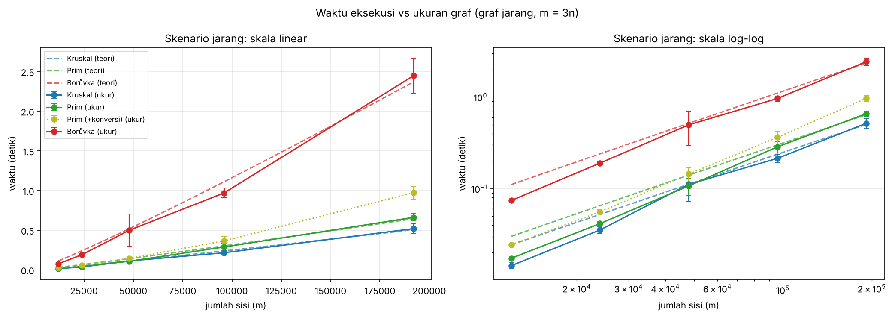
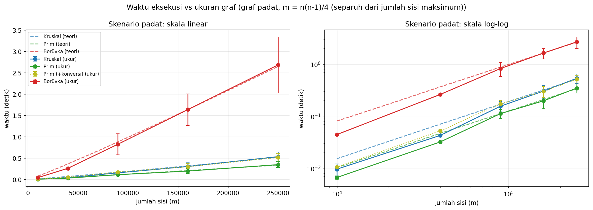
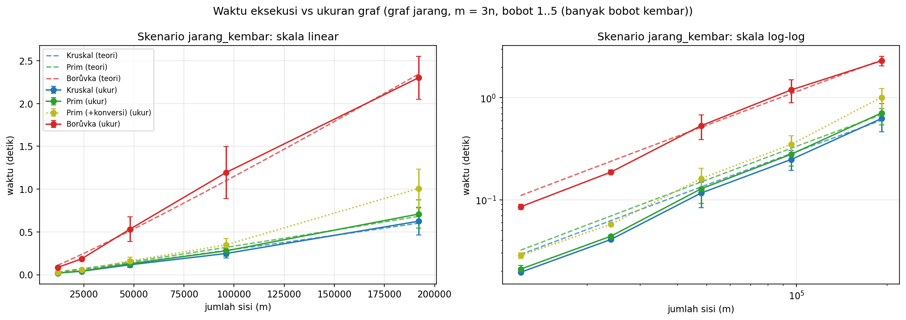

# BAB 4 IMPLEMENTASI DAN EKSPERIMEN

---

## 4.1 Studi Kasus: Jaringan Kabel antar Gedung Fakultas Teknik

---

Studi kasus memodelkan perencanaan jaringan kabel data yang menghubungkan lima gedung di Fakultas Teknik Universitas Hasanuddin, kampus Gowa, yaitu Arsitektur, Elektro, Geologi, Industri, dan Sipil. Seluruh gedung harus saling terhubung, langsung atau lewat gedung lain, dan fakultas ingin total biaya bersih pemasangan sekecil mungkin. Setiap gedung menjadi satu simpul (*n* = 5), setiap jalur kabel kandidat menjadi satu sisi (*m* = 6), dan biaya bersih pemasangan jalur dalam juta rupiah menjadi bobot sisi. Persoalannya adalah memilih himpunan jalur yang menghubungkan kelima gedung dengan total biaya bersih terkecil, yaitu MST pada graf tak berarah berbobot.

Dari sepuluh pasangan gedung, hanya enam yang diperlakukan sebagai jalur kandidat, sedangkan empat pasangan lainnya diasumsikan tidak layak dibangun karena terhalang bangunan atau jalan. Pihak universitas dalam skenario ini mendukung sebagian jalur, sehingga biaya bersih tiap jalur memiliki tiga kemungkinan makna:

- **Biaya bersih positif:** universitas tidak menanggung jalur itu, sehingga fakultas memakai dana sendiri sebesar nilai tersebut.
- **Biaya bersih nol (gratis):** seluruh biaya ditanggung universitas, tetapi fakultas tidak menerima insentif.
- **Biaya bersih negatif:** seluruh biaya ditanggung universitas dan fakultas juga menerima insentif dari universitas sebesar nilai mutlaknya.

Bobot nol dan negatif sah karena bobot sisi dalam laporan ini adalah bilangan real (butir 1 subbab 1.4), dan algoritma hanya memakai urutan bobot, bukan tanda bobot (Teorema 2.1 dan 2.2). Seluruh biaya pada studi kasus ini adalah nilai ilustrasi karangan, bukan data keuangan fakultas atau universitas yang sesungguhnya. Nilai tersebut dipakai untuk memperlihatkan bahwa ketiga algoritma bekerja pada persoalan yang bermakna, bukan untuk menyatakan rancangan jaringan yang optimal bagi kampus yang sesungguhnya.

**Tabel 4.1** Jalur kabel kandidat dan biaya bersihnya (nilai ilustrasi)

| Gedung A | Gedung B | Biaya bersih (juta rupiah) | Keterangan |
|---|---|---|---|
| Arsitektur | Sipil | −5 | Ditanggung universitas dan fakultas menerima insentif Rp5 juta |
| Sipil | Elektro | −2 | Ditanggung universitas dan fakultas menerima insentif Rp2 juta |
| Elektro | Geologi | 0 | Gratis, ditanggung universitas tanpa insentif |
| Sipil | Industri | 15 | Fakultas memakai dana sendiri Rp15 juta |
| Arsitektur | Elektro | 18 | Fakultas memakai dana sendiri Rp18 juta |
| Industri | Geologi | 25 | Fakultas memakai dana sendiri Rp25 juta |

Seluruh biaya pada Tabel 4.1 berbeda, sehingga MST pada graf ini tunggal dan komponen pemutus seri pada kunci κ (Persamaan (5)) tidak pernah menentukan urutan sisi. Kruskal mengurutkan sisi secara menaik lalu menerima sisi Arsitektur dan Sipil (−5), Sipil dan Elektro (−2), Elektro dan Geologi (0), serta Sipil dan Industri (15). Sisi terakhir ini menghubungkan dua komponen yang berbeda, yaitu {Arsitektur, Sipil, Elektro, Geologi} dan {Industri}. Setelah empat sisi (*n* − 1) diterima, pemeriksaan berhenti. Sisi Arsitektur dan Elektro (18) serta Industri dan Geologi (25) tidak diperiksa karena pemeriksaan berhenti setelah empat sisi diterima, dan keduanya akan menutup siklus.

**Tabel 4.2** Hasil ketiga algoritma pada studi kasus

| Algoritma | Jumlah sisi | Total biaya bersih (juta rupiah) |
|---|---|---|
| Kruskal | 4 | 8 |
| Prim | 4 | 8 |
| Borůvka | 4 | 8 |

Keluaran ketiga program sama dengan perhitungan manual di atas, yaitu empat sisi, sesuai banyaknya sisi pohon rentang untuk lima simpul, dengan total biaya bersih 8 juta rupiah (−5 − 2 + 0 + 15). Artinya, fakultas memakai dana sendiri Rp15 juta untuk jalur Sipil dan Industri, dan menerima insentif Rp7 juta dari dua jalur lainnya. Karena MST pada graf ini tunggal, total yang sama berarti himpunan sisinya juga sama.

Ada satu batasan makna pada bobot negatif. MST tetap harus berupa pohon yang menghubungkan seluruh gedung, sehingga jalur berbiaya negatif yang membentuk siklus tidak dipilih dan insentifnya tidak ikut dihitung. Pada data ini seluruh jalur berinsentif kebetulan masuk pohon, tetapi hasil ini bukan solusi untuk masalah "bangun jalur sebanyak mungkin demi insentif terbesar", yang merupakan masalah lain.

Dengan hanya lima simpul, studi kasus ini membuktikan kebenaran keluaran dan kegunaan MST, tetapi tidak dapat dipakai menilai efisiensi. Perbandingan waktu terhadap ukuran masukan dibahas pada eksperimen sintetis di subbab berikutnya.

---

## 4.2 Lingkungan Uji dan Implementasi

---

Seluruh pengukuran dijalankan pada satu sesi Google Colab versi gratis (*free tier*), yaitu mesin virtual yang bersifat pribadi bagi akun pengguna dengan sumber daya yang tidak dijamin tetap. Spesifikasinya dicatat oleh program pada awal sesi dan disajikan pada Tabel 4.3.

**Tabel 4.3** Lingkungan uji

| Komponen | Keterangan |
|---|---|
| Platform | Google Colab versi gratis (mesin virtual) |
| Prosesor | AMD EPYC 7B12, 2 CPU |
| Sistem operasi | Linux 6.6.122+ |
| Python | 3.13.16 |
| Pustaka | pandas 2.2.3, numpy 2.1.3 |
| *Seed* pengacak | 2026 |
| Pengukur waktu | `time.perf_counter()` |
| Eksekusi | sekuensial |

Waktu diambil dengan `time.perf_counter()` hanya di sekitar pemanggilan algoritma, setelah `gc.collect()`, dan pengumpul sampah tetap aktif selama pengukuran. Ketiga algoritma dijalankan pada graf yang sama. Kruskal dan Borůvka menerima daftar sisi, sedangkan Prim menerima daftar ketetanggaan (butir 4 subbab 1.4). Karena itu waktu Prim dicatat dua kali, yaitu waktu inti tanpa pembuatan daftar ketetanggaan dan waktu yang ditambah konversi daftar sisi menjadi daftar ketetanggaan.

Ketiga algoritma ditulis dalam Python dan berjalan sekuensial (butir 3 subbab 1.4). Kode tersimpan pada tiga berkas di repositori, yaitu `Contoh_Dasar/Kruskal/kruskal.py`, `Contoh_Dasar/Prim/prim.py`, dan `Contoh_Dasar/Borůvka/boruvka.py`. Pengurutan memakai `sorted` pada Kruskal, antrean prioritas memakai `heapq` pada Prim, dan keduanya hanya alat bantu. Struktur *disjoint set* ditulis sendiri pada kelas `HimpunanTerpisah` dengan *union by rank* dan *path halving*, dan Borůvka memakai kelas yang sama dari `kruskal.py`. Kode lengkap tersedia di repositori (lihat Lampiran). Berikut kutipan bagian inti Kruskal dan Prim beserta struktur *disjoint set*, dengan komentar pada kode asli dihilangkan agar ringkas. Kode Borůvka (*Pseudocode* 3.4) tidak dikutip dan tersedia di repositori.

**Kode 4.1** `HimpunanTerpisah` (*Pseudocode* 3.1)

```python
def cari_akar(self, simpul):
    while self.induk[simpul] != simpul:
        self.induk[simpul] = self.induk[self.induk[simpul]]
        simpul = self.induk[simpul]
    return simpul

def gabung(self, simpul_a, simpul_b):
    akar_a = self.cari_akar(simpul_a)
    akar_b = self.cari_akar(simpul_b)
    if akar_a == akar_b:
        return False
    if self.peringkat[akar_a] < self.peringkat[akar_b]:
        akar_a, akar_b = akar_b, akar_a
    self.induk[akar_b] = akar_a
    if self.peringkat[akar_a] == self.peringkat[akar_b]:
        self.peringkat[akar_a] += 1
    return True
```

`cari_akar` memendekkan lintasan menuju akar setiap kali dilalui (*path halving*). `gabung` menggantungkan pohon yang lebih rendah ke pohon yang lebih tinggi (*union by rank*) dan mengembalikan `False` jika kedua simpul sudah berada pada himpunan yang sama, yaitu jika sisi itu akan membentuk siklus.

**Kode 4.2** Kruskal (*Pseudocode* 3.2)

```python
sisi_terurut = sorted(daftar_sisi, key=lambda sisi: (sisi[2], min(sisi[0], sisi[1]), max(sisi[0], sisi[1])))
himpunan = HimpunanTerpisah(jumlah_simpul)
for simpul_a, simpul_b, bobot in sisi_terurut:
    if himpunan.gabung(simpul_a, simpul_b):
        sisi_mst.append((simpul_a, simpul_b, bobot))
        total_bobot += bobot
        if len(sisi_mst) == jumlah_simpul - 1:
            break
```

Kunci pengurutan adalah tripel κ pada Persamaan (5), yaitu bobot, simpul terkecil, lalu simpul terbesar. Sisi diterima hanya jika `gabung` mengembalikan `True`, dan perulangan berhenti segera setelah *n* − 1 sisi terkumpul. Jika setelah perulangan jumlah sisi kurang dari *n* − 1, fungsi melempar `ValueError` karena graf tidak terhubung (bagian ini tidak ditampilkan pada kutipan).

**Kode 4.3** Prim (*Pseudocode* 3.3)

```python
while antrean and len(sisi_mst) < jumlah_simpul - 1:
    bobot, kecil, besar = heapq.heappop(antrean)
    if sudah_masuk[kecil] and sudah_masuk[besar]:
        continue
    asal, tujuan = (kecil, besar) if sudah_masuk[kecil] else (besar, kecil)
    sudah_masuk[tujuan] = True
    sisi_mst.append((asal, tujuan, bobot))
    total_bobot += bobot
    for simpul_tetangga, bobot_baru in daftar_tetangga[tujuan]:
        if not sudah_masuk[simpul_tetangga]:
            heapq.heappush(antrean, (bobot_baru, min(tujuan, simpul_tetangga), max(tujuan, simpul_tetangga)))
```

Antrean berisi sisi dalam bentuk tripel (bobot, simpul kecil, simpul besar), sehingga urutannya memakai kunci κ yang sama dengan Kruskal. Sisi termurah diambil dari antrean. Jika kedua ujungnya sudah berada di pohon, sisi itu usang dan dilewati (3.2.3). Jika tidak, ujung yang belum masuk menjadi simpul baru, lalu semua sisi dari simpul itu ke simpul di luar pohon dimasukkan ke antrean.

---

## 4.3 Verifikasi Kebenaran

---

Kebenaran kode diperiksa sebelum waktu dicatat, karena waktu dari kode yang salah tidak bermakna. Pemeriksaan ini bukti empiris yang menguatkan. Bukti kebenaran formal Kruskal dan Prim ada di Bab 3, sedangkan kebenaran Borůvka tidak dibuktikan secara formal (butir 2 subbab 1.4). Tabel 4.4 merangkum pemeriksaan yang dilakukan beserta batasnya.

**Tabel 4.4** Pemeriksaan kebenaran

| Pemeriksaan | Cara | Yang ditunjukkan | Batas |
|---|---|---|---|
| Kasus uji kecil | Empat graf: tiga graf terhubung dengan total 7, 5, dan 6, serta satu graf tak terhubung yang harus menghasilkan `ValueError` | Ketiga algoritma lolos pada keempat kasus. Total 7 dan 6 sama dengan perhitungan manual di 3.1. Kasus 2 (lima simpul) memuat sisi berbobot 0 dan -2, sehingga bobot nol dan negatif ikut diuji sesuai bobot real pada butir 1 subbab 1.4 | Hanya empat graf |
| Himpunan sisi | Kasus 3 berbobot kembar membandingkan himpunan sisi. Pada studi kasus 4.1, total yang sama berarti himpunan sisi yang sama berdasarkan argumen keunikan MST | Kesamaan himpunan sisi pada graf kecil | Pada graf eksperimen yang dibandingkan hanya total bobot |
| Pembanding `networkx` | Total bobot ketiga algoritma dibandingkan dengan hasil `networkx` pada 300 graf acak kecil | Total bobot sama dengan pustaka standar | `networkx` hanya pembanding, tidak dipakai di dalam algoritma (butir 3 subbab 1.4). Yang dibandingkan total bobot |
| Uji *seed* dan pembangkit graf | *Seed* yang sama menghasilkan graf yang sama dan *seed* berbeda menghasilkan graf lain. Pada ukuran terkecil tiap skenario, graf terhubung, tanpa sisi ganda, dan tanpa *loop* | Data uji dapat diulang dan memenuhi syarat graf | Hanya diperiksa pada ukuran terkecil |
| Setiap ulangan pengukuran | Total bobot ketiga algoritma dibandingkan pada setiap ulangan, dan program berhenti jika berbeda | Tidak ada pengukuran dari hasil yang berbeda pada graf besar | Total bobot yang sama belum menjamin himpunan sisi yang sama |

Satu keterbatasan lain menyangkut kode yang diukur. Notebook memiliki langkah pencocokan otomatis antara berkas `.py` dan kode di dalam notebook, tetapi langkah itu dilewati di Colab. Karena itu kode yang diukur adalah kode di dalam notebook. Selain itu, pengukuran waktu pada subbab 4.5 dijalankan di Colab, sedangkan keempat kasus uji kecil dan studi kasus 4.1 dijalankan terpisah dari berkas `Uji_Kecil/uji_kecil.py` dan `Studi_Kasus/studi_kasus.py` di repositori. Pembandingan dengan `networkx` pada 300 graf acak dan pemeriksaan *seed* serta pembangkit graf tercatat pada log sesi Colab.

---

## 4.4 Rancangan Eksperimen

---

Pengukuran memakai tiga skenario graf (Tabel 4.5). Graf padat diberi ukuran lebih kecil karena jumlah sisinya tumbuh sebesar Θ(*n*²) (butir 5 subbab 1.4). Dengan *m* = *n*(*n* − 1)/4, yaitu separuh jumlah sisi maksimum, graf padat berukuran *n* sampai 1000 sudah memiliki sekitar 2,5 × 10⁵ sisi, sehingga jumlah sisi pada kedua kepadatan berada pada rentang yang sebanding, yaitu sekitar 10⁴ sampai 2,5 × 10⁵. Skenario ketiga memakai bentuk graf yang sama dengan skenario pertama, tetapi bobotnya hanya bilangan bulat 1 sampai 5 sehingga banyak sisi berbobot sama.

**Tabel 4.5** Skenario pengukuran

| Skenario | Jumlah sisi *m* | Ukuran *n* | Rentang *m* | Bobot |
|---|---|---|---|---|
| jarang | 3*n* | 4000, 8000, 16000, 32000, 64000 | 12000 sampai 192000 | bilangan bulat acak 1 sampai 1000000 |
| padat | *n*(*n* − 1)/4 (separuh sisi maksimum) | 200, 400, 600, 800, 1000 | 9950 sampai 249750 | bilangan bulat acak 1 sampai 1000000 |
| jarang_kembar | 3*n* | 4000, 8000, 16000, 32000, 64000 | 12000 sampai 192000 | bilangan bulat acak 1 sampai 5 |

Graf dibangkitkan dengan `random.Random` ber-*seed* 2026. Pembangkit membentuk pohon acak terlebih dahulu, dengan setiap simpul dihubungkan ke satu simpul bernomor lebih kecil, sehingga graf pasti terhubung. Sisi acak lalu ditambahkan tanpa sisi ganda dan tanpa *loop* sampai jumlah sisi terpenuhi.

Untuk setiap pasangan skenario dan ukuran, satu graf dibangkitkan. Satu putaran pemanasan dijalankan lebih dahulu dan tidak dicatat, lalu pengukuran diulang lima kali pada graf yang sama (butir 6 subbab 1.4). Karena graf yang sama dipakai pada kelima ulangan, simpangan baku hanya mengukur gangguan waktu pada mesin, bukan variasi antar graf. Hasil setiap kombinasi dilaporkan sebagai rata-rata dan simpangan baku sampel (pembagi *n* − 1).

---

## 4.5 Hasil

---

Hasil pengukuran disajikan per skenario pada Tabel 4.6 sampai 4.8 sebagai rata-rata ± simpangan baku dari lima ulangan, dalam milidetik. Grafik waktu terhadap jumlah sisi beserta kurva teoretis ada pada Gambar 4.1 sampai 4.3, dan rasio waktu terhadap suku teoretis ada pada Tabel 4.9.

**Tabel 4.6** Waktu eksekusi skenario jarang (*m* = 3*n*), rata-rata ± simpangan baku dalam ms

| *n* | *m* | Kruskal | Prim | Prim (+konversi) | Borůvka |
|---|---|---|---|---|---|
| 4000 | 12000 | 23,34 ± 4,56 | 26,75 ± 7,12 | 37,07 ± 7,24 | 82,22 ± 4,70 |
| 8000 | 24000 | 73,68 ± 29,60 | 79,45 ± 37,38 | 110,56 ± 48,99 | 236,69 ± 44,25 |
| 16000 | 48000 | 110,94 ± 27,67 | 140,46 ± 34,93 | 178,84 ± 40,88 | 475,67 ± 67,04 |
| 32000 | 96000 | 272,78 ± 43,99 | 344,61 ± 76,48 | 436,70 ± 69,62 | 1334,94 ± 619,36 |
| 64000 | 192000 | 719,21 ± 99,75 | 958,82 ± 127,84 | 1384,46 ± 229,69 | 3327,51 ± 662,29 |

**Tabel 4.7** Waktu eksekusi skenario padat (*m* = *n*(*n* − 1)/4), rata-rata ± simpangan baku dalam ms

| *n* | *m* | Kruskal | Prim | Prim (+konversi) | Borůvka |
|---|---|---|---|---|---|
| 200 | 9950 | 9,85 ± 2,55 | 9,44 ± 1,88 | 15,09 ± 1,89 | 38,74 ± 1,64 |
| 400 | 39900 | 61,08 ± 12,09 | 44,77 ± 7,95 | 70,07 ± 12,81 | 219,53 ± 15,23 |
| 600 | 89850 | 194,87 ± 46,10 | 126,87 ± 28,17 | 196,35 ± 53,07 | 550,23 ± 47,88 |
| 800 | 159800 | 402,03 ± 63,56 | 240,12 ± 50,03 | 370,69 ± 62,06 | 1345,57 ± 151,75 |
| 1000 | 249750 | 621,69 ± 150,18 | 348,85 ± 42,80 | 559,36 ± 66,78 | 2065,66 ± 92,50 |

**Tabel 4.8** Waktu eksekusi skenario jarang_kembar (*m* = 3*n*, bobot 1 sampai 5), rata-rata ± simpangan baku dalam ms

| *n* | *m* | Kruskal | Prim | Prim (+konversi) | Borůvka |
|---|---|---|---|---|---|
| 4000 | 12000 | 20,32 ± 2,07 | 20,77 ± 2,24 | 29,30 ± 3,22 | 75,54 ± 5,61 |
| 8000 | 24000 | 44,36 ± 6,55 | 50,11 ± 9,09 | 67,20 ± 11,76 | 174,79 ± 23,12 |
| 16000 | 48000 | 148,68 ± 46,14 | 147,48 ± 59,19 | 198,56 ± 84,06 | 500,87 ± 86,75 |
| 32000 | 96000 | 307,13 ± 62,25 | 323,99 ± 72,11 | 418,33 ± 81,74 | 1012,33 ± 148,78 |
| 64000 | 192000 | 632,75 ± 94,40 | 762,17 ± 177,56 | 1169,66 ± 90,77 | 2299,18 ± 247,31 |



**Gambar 4.1** Waktu eksekusi terhadap jumlah sisi pada skenario jarang. Kiri: skala linear. Kanan: skala log-log. Batang galat adalah simpangan baku, dan garis putus-putus adalah kurva teoretis dengan konstanta yang dicocokkan dengan kuadrat terkecil melalui titik asal.



**Gambar 4.2** Waktu eksekusi terhadap jumlah sisi pada skenario padat, dengan keterangan yang sama dengan Gambar 4.1.



**Gambar 4.3** Waktu eksekusi terhadap jumlah sisi pada skenario jarang_kembar, dengan keterangan yang sama dengan Gambar 4.1.

Kurva teoretis pada gambar memakai suku *m* log₂ *m* untuk Kruskal dan *m* log₂ *n* untuk Prim dan Borůvka. Kurva Prim (+konversi) tidak memiliki kurva teoretis sendiri.

**Tabel 4.9** Rasio waktu terhadap suku teoretis, dinormalkan ke ukuran terkecil tiap skenario (= 1,00)

| Skenario | *n* | Kruskal (*m* log *n*) | Prim (*m* log *n*) | Borůvka (*m* log *n*) | Borůvka (*m* log² *n*) |
|---|---|---|---|---|---|
| jarang | 4000 | 1,00 | 1,00 | 1,00 | 1,00 |
| jarang | 8000 | 1,46 | 1,37 | 1,33 | 1,23 |
| jarang | 16000 | 1,02 | 1,12 | 1,24 | 1,06 |
| jarang | 32000 | 1,17 | 1,29 | 1,62 | 1,30 |
| jarang | 64000 | 1,44 | 1,68 | 1,90 | 1,42 |
| padat | 200 | 1,00 | 1,00 | 1,00 | 1,00 |
| padat | 400 | 1,37 | 1,05 | 1,25 | 1,11 |
| padat | 600 | 1,81 | 1,23 | 1,30 | 1,08 |
| padat | 800 | 2,01 | 1,25 | 1,71 | 1,36 |
| padat | 1000 | 1,93 | 1,13 | 1,63 | 1,25 |
| jarang_kembar | 4000 | 1,00 | 1,00 | 1,00 | 1,00 |
| jarang_kembar | 8000 | 1,01 | 1,11 | 1,07 | 0,99 |
| jarang_kembar | 16000 | 1,57 | 1,52 | 1,42 | 1,22 |
| jarang_kembar | 32000 | 1,51 | 1,56 | 1,34 | 1,07 |
| jarang_kembar | 64000 | 1,46 | 1,72 | 1,43 | 1,07 |

Rasio pada Tabel 4.9 dihitung dari rata-rata pada Tabel 4.6 sampai 4.8, dengan suku *m* log₂ *n* untuk ketiga algoritma agar sesuai dengan cara pemeriksaan pada Tabel 3.10. Karena itu rasio Kruskal di sini dapat berbeda dari keluaran notebook, yang memakai *m* log₂ *m* untuk Kruskal. Kolom terakhir adalah rasio Borůvka terhadap suku *m* log² *n*.

Data pada Tabel 4.6 sampai 4.8 menunjukkan hal berikut. Pada skenario jarang, Kruskal memiliki rata-rata terendah pada kelima ukuran. Pada skenario jarang_kembar Kruskal terendah pada empat ukuran dan Prim tanpa konversi terendah pada *n* = 16000 (147,48 dibandingkan 148,68 ms). Pada skenario padat Prim tanpa konversi terendah pada kelima ukuran. Borůvka paling lambat pada semua ukuran, yaitu 3,32 sampai 4,63 kali waktu Kruskal pada ukuran terbesar. Pembuatan daftar ketetanggaan menambah waktu Prim sebesar 44,4% (jarang), 60,3% (padat), dan 53,5% (jarang_kembar) pada ukuran terbesar, dan simpangan baku berkisar dari 4,2% sampai 47,0% dari rata-rata, tertinggi pada Prim skenario jarang dengan *n* = 8000.


## 4.6 Pembahasan

---

Sesuai ketentuan di 3.5.4, ketidaksesuaian prediksi pada Tabel 3.10 dilaporkan apa adanya dan tidak disesuaikan. Tabel 4.10 merangkum status keenam prediksi, dan uraian tiap prediksi menyusul.

**Tabel 4.10** Status prediksi Tabel 3.10 terhadap data Bab 4

| No | Prediksi | Status | Dasar singkat |
|---|---|---|---|
| 1 | Kruskal dan Prim tidak tumbuh lebih cepat daripada *m* log *n* | Tidak terpenuhi | *T*/(*m* log *n*) pada ukuran terbesar berada 1,13 sampai 1,93 kali ukuran terkecil pada keenam kombinasi, tidak naik monoton, dan yang terkecil (Prim, padat) masih dalam jangkauan gangguan |
| 2 | Borůvka tidak tumbuh lebih cepat daripada *m* log² *n* | Terpenuhi sebagian | Rasio terhadap *m* log² *n* pada ukuran terbesar 1,42 (jarang), 1,25 (padat), dan 1,07 (jarang_kembar), sehingga hanya jarang_kembar yang mendekati 1 |
| 3 | Kruskal atau Prim lebih cepat | Hanya dilaporkan | Kruskal terendah pada graf jarang (5 dari 5 ukuran) dan jarang_kembar (4 dari 5), Prim tanpa konversi pada graf padat (5 dari 5) |
| 4 | Pembuatan *Adj* menambah waktu Prim | Terpenuhi | Prim (+konversi) lebih lambat pada 15 dari 15 ukuran |
| 5 | Bobot kembar tidak mengubah batas waktu dan total bobot | Terpenuhi | Rasio waktu jarang_kembar terhadap jarang tidak naik terhadap *n* dan total bobot sama pada setiap ulangan. Borůvka dan Prim justru lebih cepat pada bobot kembar di 4 dari 5 ukuran, yang tidak diprediksi. Himpunan sisi diperiksa hanya pada graf kecil |
| 6 | Keluaran ketiga algoritma sama | Terpenuhi | Total bobot sama pada 15 graf eksperimen dan himpunan sisi sama pada graf kecil, tetapi himpunan sisi graf eksperimen tidak dibandingkan |

### 4.6.1 Pertumbuhan Kruskal dan Prim (Prediksi 1)

Prediksi 1 tidak terpenuhi dalam bentuk yang ditetapkan di 3.5.4. Jika batas *m* log *n* ketat, *T*/(*m* log *n*) hampir konstan, dan jika longgar, nilainya turun. Pada Tabel 4.9 nilainya pada ukuran terbesar berada di atas nilai ukuran terkecil pada keenam kombinasi. Kruskal berada pada 1,44 (jarang), 1,93 (padat), dan 1,46 (jarang_kembar) kali nilai ukuran terkecil, dan Prim pada 1,68, 1,13, dan 1,72 kali. Kenaikannya tidak monoton, misalnya Kruskal skenario jarang naik ke 1,46 pada *n* = 8000 lalu turun ke 1,02 pada *n* = 16000. Kenaikan terkecil, yaitu Prim skenario padat (1,13), masih dalam jangkauan gangguan pengukuran karena simpangan baku Prim pada skenario itu 19,9% dari rata-rata pada *n* = 200 dan 12,3% pada *n* = 1000. Eksponen empiris *T* ∝ *m*^α yang dihitung dari ukuran terkecil dan terbesar memberi gambaran yang sama. Pada skenario jarang eksponennya 1,236 (Kruskal) dan 1,291 (Prim), pada skenario padat 1,286 dan 1,120, dan pada skenario jarang_kembar 1,240 dan 1,299. Eksponen lokal dari *m* log *n* pada rentang yang sama adalah 1,104 untuk skenario jarang dan jarang_kembar, serta 1,082 untuk skenario padat. Keenam eksponen empiris lebih besar daripada eksponen lokal itu, dengan selisih terkecil pada Prim skenario padat (1,120 dibandingkan 1,082). Artinya, pada data ini waktu Kruskal dan Prim tumbuh lebih cepat daripada *m* log *n*, dengan bukti paling kuat pada Kruskal dan pada Prim skenario jarang dan jarang_kembar, dan paling lemah pada Prim skenario padat.

Hasil ini tidak membantah Teorema 3.5 dan 3.6. Kedua teorema adalah batas atas asimtotik, sedangkan data hanya mencakup rentang terbatas (faktor 16 pada *m* untuk skenario jarang dan jarang_kembar, dan 25,1 untuk skenario padat). Yang ditunjukkan data adalah bahwa model *T* = *c* · *m* log *n* dengan konstanta tetap tidak cocok untuk kode ini pada rentang tersebut, sehingga ada pengaruh yang belum dimodelkan. Penyebabnya tidak diuji pada penelitian ini. Dugaan seperti pengaruh memori dan *cache* pada struktur data yang membesar, atau biaya alokasi dan *garbage collector* Python, masuk akal, tetapi tidak ada pengukuran di laporan ini yang membedakannya, sehingga hanya disebut sebagai dugaan. Satu petunjuk tidak langsung adalah biaya pembuatan *Adj* per elemen (*n* + *m*), yaitu selisih Prim (+konversi) dan Prim dibagi *n* + *m*. Pada ukuran terbesar biayanya 1,663 µs (jarang), 0,839 µs (padat), dan 1,592 µs (jarang_kembar), yaitu 2,6, 1,5, dan 3,0 kali nilai pada ukuran terkecil (0,645, 0,557, dan 0,534 µs). Kenaikannya tidak monoton pada skenario jarang dan jarang_kembar (misalnya 0,972 µs pada *n* = 8000 lalu 0,600 µs pada *n* = 16000 untuk skenario jarang). Operasi *O*(*n* + *m*) seharusnya memiliki biaya per elemen yang tetap, sehingga kenaikan pada ukuran terbesar menunjukkan bahwa kecepatan per operasi dasar tidak tetap pada rentang ukuran ini, yang konsisten dengan adanya pengaruh di luar model operasi. Ini tetap petunjuk, bukan penjelasan yang terbukti, karena biaya itu dihitung dari selisih dua rata-rata yang masing-masing memiliki gangguan.

### 4.6.2 Pertumbuhan Borůvka (Prediksi 2)

Prediksi 2 terpenuhi sebagian. Pada kolom *m* log² *n* di Tabel 4.9, rasio Borůvka pada ukuran terbesar adalah 1,42 (jarang), 1,25 (padat), dan 1,07 (jarang_kembar). Pada skenario jarang rasio naik pada dua ukuran terbesar (1,06, 1,30, lalu 1,42). Pada skenario padat rasio naik sampai *n* = 800 (1,36) lalu turun ke 1,25 pada *n* = 1000. Pada skenario jarang_kembar rasio datar pada dua ukuran terbesar (1,07 dan 1,07). Eksponen empiris Borůvka adalah 1,335 (jarang), 1,234 (padat), dan 1,232 (jarang_kembar), sedangkan eksponen lokal *m* log² *n* adalah 1,208, 1,165, dan 1,208. Selisihnya 0,127, 0,069, dan 0,024, sehingga hanya skenario jarang_kembar yang mendekati batas *m* log² *n*, dan skenario jarang paling jauh melampauinya. Rasio terhadap *m* log² *n* juga lebih datar daripada terhadap *m* log *n* (1,90, 1,63, dan 1,43 pada ukuran terbesar) di ketiga skenario, yang sejalan dengan Teorema 3.7 bahwa batasnya lebih besar daripada *m* log *n*.

Ada tiga alasan untuk tidak membaca hasil ini sebagai bukti ketat. Pertama, pada skenario jarang waktu tumbuh lebih cepat daripada *m* log² *n*, dan pada skenario padat sedikit lebih cepat, sehingga prediksi tidak terpenuhi di dua dari tiga skenario jika dibaca ketat. Kedua, titik *n* = 32000 pada skenario jarang memiliki simpangan baku 619,36 ms atau sekitar 46% dari rata-rata, sehingga rasio di titik itu (1,62 dan 1,30) tidak ditafsirkan. Ketiga, Kruskal dan Prim yang batasnya lebih rendah ternyata juga tumbuh lebih cepat daripada batasnya (4.6.1), sehingga rasio Borůvka terhadap *m* log² *n* yang mendekati 1 pada skenario jarang_kembar dapat berasal dari pengaruh yang sama yang menaikkan ketiganya, bukan dari ketatnya batas tersebut.

### 4.6.3 Kruskal dan Prim (Prediksi 3)

Tabel 3.10 tidak memuat prediksi arah untuk perbandingan ini, jadi bagian ini melaporkan hasilnya. Pada skenario jarang, Kruskal memiliki rata-rata terendah pada kelima ukuran. Pada skenario jarang_kembar, Kruskal terendah pada empat ukuran, sedangkan pada *n* = 16000 Prim sedikit lebih rendah (147,48 dibandingkan 148,68 ms). Pada skenario padat, Prim tanpa konversi memiliki rata-rata terendah pada kelima ukuran. Arah ini sejalan dengan laporan Osipov *et al.* (2009) bahwa Kruskal baik pada graf yang tidak terlalu padat, tetapi kondisinya berbeda: laporan itu memakai C++, sedangkan laporan ini memakai Python dengan `heapq` dan `sorted`.

Besar selisihnya perlu dibaca bersama simpangan baku. Pada skenario padat, selisih rata-rata Kruskal dan Prim lebih besar daripada simpangan baku kedua algoritma pada empat ukuran (*n* = 400 sampai 1000), sedangkan pada *n* = 200 selisihnya hanya 0,40 ms, jauh di bawah simpangan baku keduanya (2,55 dan 1,88 ms). Pada skenario jarang, selisih melebihi simpangan baku kedua algoritma hanya pada *n* = 64000 (239,62 ms dibandingkan 99,75 dan 127,84 ms). Pada *n* = 16000 dan 32000 selisihnya hanya melebihi simpangan baku yang lebih kecil, dan pada dua ukuran terkecil selisihnya lebih kecil daripada keduanya. Pada skenario jarang_kembar tidak ada ukuran yang selisihnya melebihi kedua simpangan baku, dan *n* = 64000 hanya melebihi yang lebih kecil (129,43 ms dibandingkan 94,40 dan 177,56 ms). Karena itu urutan Kruskal sebelum Prim pada graf jarang hanya cukup jelas pada skenario jarang dengan *n* = 64000, dan tidak dapat dipastikan pada ukuran lain maupun pada skenario jarang_kembar.

Hasil ini juga tidak menetapkan titik silang. Pada skenario padat, *n* berubah bersama kepadatan (*m*/*n* = (*n* − 1)/4, yaitu 49,75 pada *n* = 200 sampai 249,75 pada *n* = 1000), sedangkan pada skenario jarang *m*/*n* tetap 3. Titik silang berada di antara dua rentang itu, dan data tidak memuat kepadatan di antaranya, sebagaimana sudah dinyatakan di Tabel 3.10. Selain itu, keunggulan Prim pada skenario padat bergantung pada *Adj* yang sudah tersedia. Jika pembuatan *Adj* dihitung, Prim (+konversi) lebih lambat daripada Kruskal pada *n* = 200 sampai 600 dan lebih cepat hanya pada *n* = 800 dan 1000, dengan selisih 62,33 ms pada *n* = 1000 (559,36 dibandingkan 621,69 ms) yang lebih kecil daripada simpangan baku keduanya (66,78 dan 150,18 ms). Jadi dengan biaya konversi dihitung, data tidak menunjukkan keunggulan Prim di skenario padat. Bagi Borůvka, waktunya paling tinggi pada semua ukuran di ketiga skenario, yaitu 3,32 sampai 4,63 kali Kruskal pada ukuran terbesar. Hal ini sejalan dengan faktor log tambahan pada Teorema 3.7 dan dengan kenyataan bahwa Borůvka memindai seluruh sisi pada setiap putaran, tetapi pembagian pengaruhnya tidak diukur.

### 4.6.4 Biaya Daftar Ketetanggaan (Prediksi 4)

Prediksi 4 terpenuhi dalam arah dan tidak dalam besaran konstan. Prim (+konversi) lebih lambat daripada Prim tanpa konversi pada seluruh 15 ukuran, dan pada ukuran terbesar penambahannya 44,4% (jarang), 60,3% (padat), dan 53,5% (jarang_kembar). Besarnya sebanding dengan suku *O*(*n* + *m*), tetapi biaya per elemen pada ukuran terbesar lebih tinggi daripada pada ukuran terkecil seperti dijelaskan di 4.6.1, sehingga pada rentang ini suku tersebut tidak berperilaku seperti biaya linear dengan konstanta tetap. Perlu dicatat bahwa kolom "tanpa konversi" menyiratkan graf sudah tersedia sebagai *Adj*, sedangkan Kruskal dan Borůvka bekerja langsung pada daftar sisi. Perbandingan yang adil bergantung pada bentuk data yang diterima program, dan dua kolom Prim pada tabel hasil menunjukkan kedua keadaan.

### 4.6.5 Pengaruh Bobot Kembar (Prediksi 5)

Prediksi 5 mengandung dua bagian. Bagian pertama, bahwa batas waktu tidak berubah, tidak ditolak oleh data. Rasio waktu skenario jarang_kembar terhadap skenario jarang pada *n* dan *m* yang sama berkisar dari 0,60 sampai 1,34 untuk Kruskal, 0,63 sampai 1,05 untuk Prim, dan 0,69 sampai 1,05 untuk Borůvka, dan pada ukuran terbesar nilainya 0,88, 0,79, dan 0,69. Rasio itu tidak naik terhadap *n*, sehingga data tidak menunjukkan bobot kembar memperlambat pertumbuhan waktu. Namun arahnya tidak sepenuhnya acak. Waktu Prim dan Borůvka lebih rendah pada bobot kembar di empat dari lima ukuran (semua kecuali *n* = 16000). Selisih Borůvka melebihi simpangan baku kedua skenario pada tiga ukuran (*n* = 4000, 8000, dan 64000), dan selisih Prim hanya pada *n* = 64000. Waktu Kruskal lebih rendah pada tiga dari lima ukuran dan selisihnya tidak melebihi simpangan baku kedua skenario pada ukuran mana pun. Penyebab selisih ini tidak diuji dan tidak diprediksi di Tabel 3.10. Kedua skenario memakai graf berbobot berbeda yang diukur pada saat berbeda, sehingga perbedaan keadaan mesin tidak dapat dipisahkan dari pengaruh bobot (4.6.7). Tidak adanya perlambatan pada bobot kembar sejalan dengan rancangan, karena kunci κ mengurutkan seluruh sisi secara total dan perbandingan κ tidak lebih mahal ketika bobotnya sama.

Bagian kedua, bahwa total bobot ketiga algoritma sama, terpenuhi: totalnya sama pada setiap ulangan di skenario jarang_kembar. Rumusan prediksi ini pada Tabel 3.10 dibatasi pada total bobot di graf eksperimen dan himpunan sisi di graf kecil (Kasus 3 di 4.3), sehingga kesamaan himpunan sisi pada graf besar berbobot kembar tidak diklaim.

### 4.6.6 Kesamaan Keluaran (Prediksi 6)

Prediksi 6 terpenuhi pada cakupan yang dirumuskan di Tabel 3.10. Total bobot ketiga algoritma sama pada setiap ulangan di 15 graf eksperimen, dan program berhenti jika berbeda. Himpunan sisi dibandingkan pada kasus uji kecil dan pada studi kasus 4.1. Pada graf eksperimen yang dibandingkan hanya total bobot, sehingga kesamaan himpunan sisi pada graf besar tidak diperiksa dan tidak diklaim. Untuk Kruskal dan Prim, kesamaan himpunan sisi dijamin oleh Teorema 3.3. Untuk Borůvka tidak ada bukti formal (butir 2 subbab 1.4), sehingga kesamaan total bobot dan himpunan sisi pada graf kecil adalah bukti empiris dan bukan pengganti bukti.

### 4.6.7 Ancaman terhadap Validitas

Hasil di atas berlaku dengan batas berikut.

1. **Gangguan waktu besar.** Simpangan baku mencapai sekitar 47% dari rata-rata (Prim, skenario jarang, *n* = 8000), dan 21 dari 60 kombinasi algoritma dan ukuran memiliki simpangan baku sekurang-kurangnya 20% dari rata-rata. Selisih yang lebih kecil daripada simpangan baku tidak ditafsirkan, dan hal ini membatasi kesimpulan prediksi 2, 3, dan 5.
2. **Sumber daya Colab dan satu graf per ukuran.** Eksperimen berjalan pada Colab versi gratis, yang sumber dayanya tidak dijamin tetap, sehingga kecepatan mesin dapat berubah selama sesi. Setiap ukuran diwakili satu graf (*seed* 2026) dan kelima ulangan dijalankan pada graf yang sama, sehingga simpangan baku hanya mengukur gangguan waktu, bukan variasi antar graf (4.4).
3. **Urutan eksekusi tetap.** Dalam setiap ulangan urutannya selalu pembuatan *Adj*, Kruskal, Prim, lalu Borůvka. Pengaruh urutan, misalnya keadaan memori atau *garbage collector* dari algoritma sebelumnya, tidak diacak dan tidak dapat dipisahkan dari perbedaan antar algoritma.
4. **Rentang ukuran sempit.** *n* terbesar 64000 pada graf jarang dan 1000 pada graf padat, jauh di bawah 10⁶ pada contoh di slide ketentuan. Lima ukuran hanya mencakup faktor 16 sampai 25 pada *m*, sehingga eksponen empiris pada 4.6.1 bersifat lokal. Pada skenario padat, *n* dan kepadatan berubah bersamaan (4.4).
5. **Cakupan terbatas.** Hanya dua kepadatan dan satu varian bobot kembar yang diuji, hanya dalam Python, dan hanya waktu yang diukur sehingga ruang dianalisis secara teoretis saja (butir 6 subbab 1.4).

Rasio waktu terhadap teori pada ukuran terbesar masih di atas nilai ukuran terkecil untuk ketiga algoritma, jadi pernyataan tentang pertumbuhan hanya berlaku pada rentang yang diukur dan tidak boleh diekstrapolasi ke ukuran yang lebih besar tanpa pengukuran tambahan.

---
